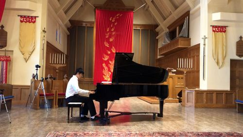

When I'm not taking care of my succulents, I enjoy playing the piano. I have been playing classical music since age five; this makes it my longest ongoing passion. Beyond teaching me perseverance, discipline, and expression — piano is a gift that I get to share with my friends and family. If you like classical music or want to break into it, here are my current favorites:
- Scherzo No. 2 in B♭ Minor, Op. 31 (Chopin)
- Ballade No. 1 in G minor, Op. 23 (Chopin)
- Un Sospiro (Liszt).

Here's a picture from my 2018 recital :
