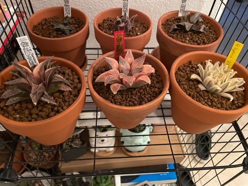

In my spare time, I tend to my succulent collection. Most of my plants belong to the Haworthia genus endemic to Southern Africa. When I first encountered them at my local nursery, I was immediately drawn to their unique shapes and appearances. Check out my custom rack lined with grow lights that feed these spectacular plants:

Tending to my succulents is a therapeutic experience for me, and has even taught me life lessons. As much as I'd like them to, my plants don't grow overnight after watering—it takes consistency and time. This is a principle that I try to apply toward any goal in life.

For most of my plants, I use a clay pots with akadama soil. If you want to adopt this setup, keep in mind that it demands more frequent watering The subtrate and pot are more porous than plastic and ceramic pots and dry out faster.