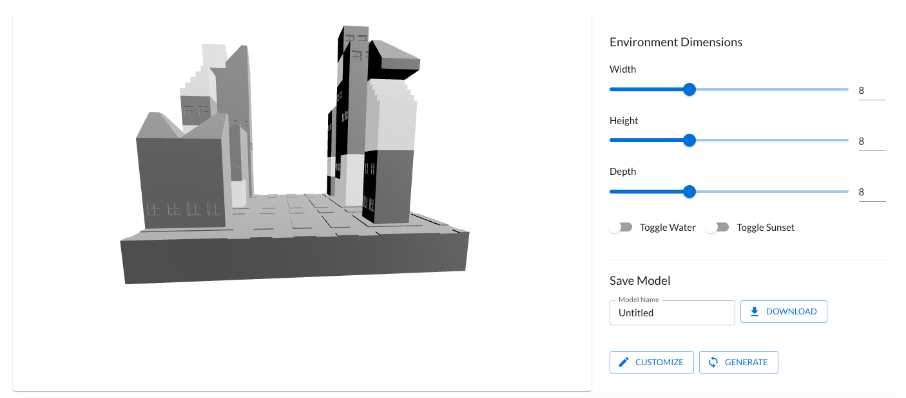

## Description

Web app to procedurally generate custom 3D environments through a graphical interface. Users can upload their own 3D models and textures, and use them to generate new environments. The app uses Wave Function Collapse (WFC) to generate the environments. This tool is built for designers inexperienced with code-oriented tools to iterate on environments quickly.

### WFC

Suppose we have an $N\times N$ grid, a set of tiles, and constraints relating tile adjacency. The goal of WFC is to fill the grid with tiles such that the tiles satisfy the constraints. The algorithm can be summarized as follows:

```
While not all tiles are collapsed:
    1. Observe the grid and calculate the entropy of each cell.
    2. Collapse the cell with the lowest entropy.
    3. Propagate the constraints to neighboring cells.
```

Entropy is calculated as the sum of the negative log probabilities of each tile in the cell. The cell is collapsed by sampling from the distribution of the cell's tiles, effectively placing a tile. At the start, most cells have the same entropy, so we collapse a random cell. We then look at the constraints of the tile we placed, and eliminate tiles that violate the constraints in neighboring cells. We propagate these constraints to neighboring cells, and repeat the process until all cells are collapsed.

### Generating Constraints

Much of my work was in generating adjacency constraints for the tiles. In simpler words, algorithmically determine which tiles could be placed next to each other. Given a set of tiles, we consider their symmetries and the geometries of their mesh faces. For example, two wall tiles with matching side faces can be placed next to each other. Furthermore, this constraint should be rotationally invariant, but only about the vertical axis. By parsing these two properties, we can automatically generate constraints for a set of well-behaved tiles.

Here is an example of a generated environment:

