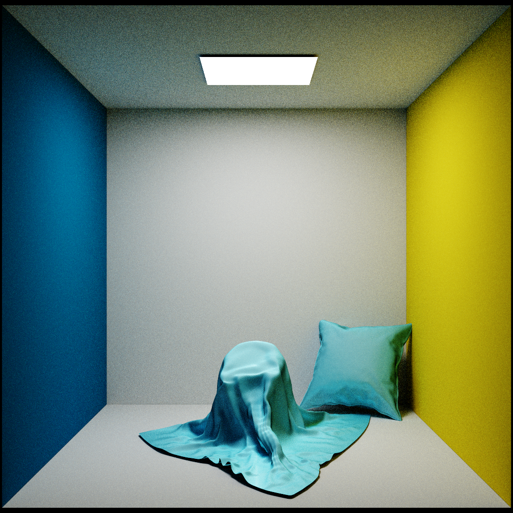
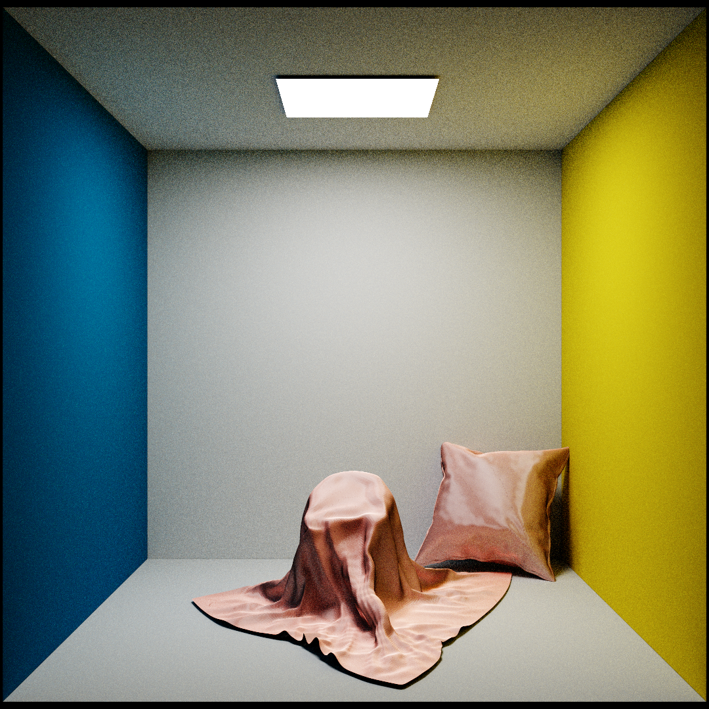
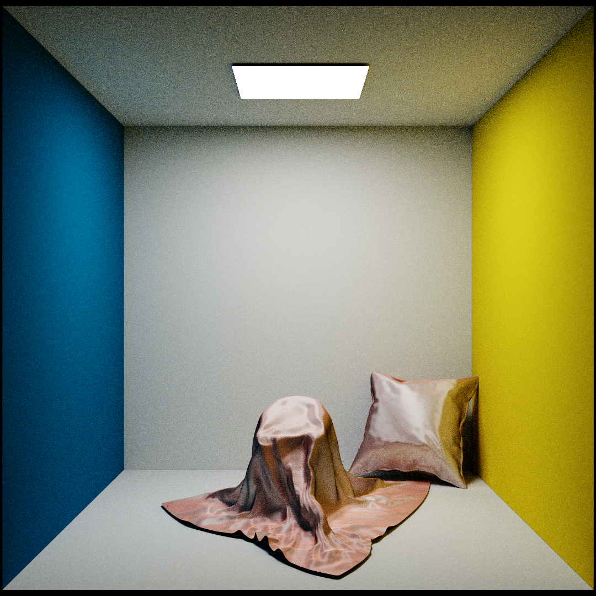

## Description
A C++ implementation of [*A Practical Microcylinder Appearance Model for Cloth Rendering*](https://sadeghi.com/A-Practical-Microcylinder-Appearance-Model-for-Cloth-Rendering/) with path tracing. I implemented the following features:

### Thread Parameterization
Each thread is represented as a microcylinder with a tangent distribution. Cloths are made by choosing two threads comprising the following attributes:

- $\eta$: Cylinder reflection normal
- $A$: Colored albedo coefficient
- $k_d$: Isoptropic scattering coefficient
- $\gamma_s$: Surface reflectance gaussian width
- $\gamma_v$: Volume scattering gaussian width
- $a$: Area coverage ratio
- Tangent offsets and lengths
‍
### Curve Radiance Integral

$$
L_r = \int f_s(t, \omega_i, \omega_r) L_i(\omega_i) \cos(\theta_i) d\omega_i
$$

Cloth fibers are represented as microcylinders. Unlike the standard surface radiance integral, the curve radiance integral accounts for light scattered around teh circumference of the microcylinder.

### Bidirectional Scattering Distribution Function (BSDF)

The BSDF is split into a surface scattering function

$$
f_{r, s}(t, \omega_i, \omega_r) = F_r(\eta, \vec{\omega}_i)\cos(\phi_d/2)g(\gamma_s, \theta_h),
$$

and a volume scattering function

$$
f_{r, v}(t, \omega_i, \omega_r) = F_t(\eta, \vec{\omega}_i)F_t(\eta^\prime, \vec{\omega^\prime}_r)\frac{(1-k_d)g(\gamma_v, \theta_h) + k_d}{\cos(\theta_i) + \cos(\theta_r)} A.
$$

Together, these functions compose the BSDF:

$$
f_s(t, \omega_i, \omega_r) = \frac{f_{r, s}(t, \omega_i, \omega_r) + f_{r, v}(t, \omega_i, \omega_r)}{\cos^2(\theta_d)}.
$$

### Masking

The overall shadowing and masking term introduced by grazing angles and self-masking is

$$
M(t, \omega_i, \omega_r) = (1-u(\phi_d))M(t, \omega_i)M(t, \omega_r) + u(\phi_d){\text{min}}(M(t, \omega_i), M(t, \omega_r)).
$$

### Shading Model

The total outgoing radiance of a minimal patch is the weighted average of the outgoing radiance of two constituent threads:

$$
L_r(\omega_r) = a_1 L_{r,1}(\omega_r) + a_2 L_{r,2}(\omega_r).
$$

Putting it all together, each thread's radiance is computed by averaging the curve radiance integral with masking under its tangent distribution:

$$
L_{r,j} = \frac{1}{N_j} \sum_{t} \int L_i(\omega_i) f_s(t, \omega_i, \omega_r) M(t, \omega_i, \omega_t) \cos(\theta_i) d\omega_i.
$$

## Results
I tested my implementation on a custome scene made in Blender. All rendered images are done at 1028spp with a resolution of 1080 by 1080. Listed in the original paper, these cloths are , Polyester Satin Charmeuse, and back side of Polyester Satin Charmeuse.
### Linen Plain Fabric

### Polyester Satin Charmeuse

### Polyester Satin Charmeuse Back
