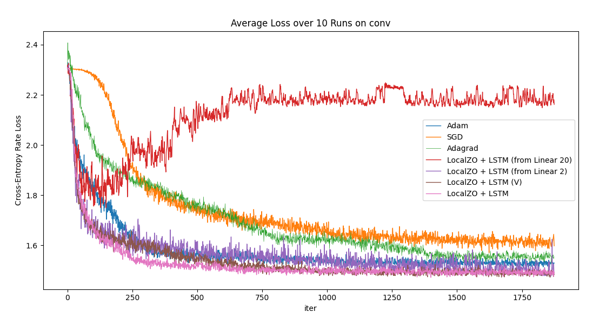

## Description
An end-to-end training framework for spiking neural networks (SNNs) by combining zeroth-order optimization and meta-learning for gradient estimation.

## Background
Spiking neural networks (SNNs) imitate biological neurons through the spiking function, and are very on neuromorphic hardware. The building block of SNNs is the leaky integrate-and-fire (LIF) neuron model, which is a simple model that biological realism and computational practicality. LIF-based SNNs are governed by the following equations:

$$
U[t] = \beta U[t-1] + {\textbf{W}}X[t] - S_{out}[t - 1]\theta
$$
$$
S_{out}[t] = \begin{cases}
    1 & \text{if } U[t] \geq \theta \\
    0 & \text{otherwise}
\end{cases}.
$$

Here, $U[t]$ is the membrane potential, $X[t]$ is the input, ${\textbf{W}}$ is the learnable weight matrix, $S_{out}[t]$ is the output, and $\theta$ is the threshold. The output is binary, and the neuron spikes when the membrane potential exceeds the threshold. The membrane potential leaks over time and is reset to zero when the potential crosses the threshold. The spiking function is the heaviside step function, and serves as the non-linear activation function. **Sadly**, the heaviside step function is non-differentiable, so we can't just backpropagate through the network to train it.

## Approach

### Gradient Estimation

**Luckily**, we can use zeroth-order optimization to estimate the gradient of a smooth approximation of the heaviside step function. This is the method proposed in the [LocalZO](https://arxiv.org/abs/2302.00910) paper. They use the 2-point estimator with antithetic sampling to estimate the gradient of the heaviside step function. The 2-point estimator is defined as:

$$
\hat{\nabla} f({\textbf{x}}) = \phi(d) \frac{f({\textbf{x}} + \mu {\textbf{z}}) - f({\textbf{x}} - \mu{\textbf{z}})}{2\mu}{\textbf{z}},
$$

where $\phi(d)$ is a dimension-dependent factor, and ${\textbf{z}}$ is a random perturbation sampled from a distribution $\lambda$ such that $\mathbb{E}[\lVert\textbf{z}\rVert^2] = 1$. Applied to the heaviside step function, the 2-point estimator averaged over $m$ samples becomes:

$$
\hat{\nabla} S_{out}[t] = \frac{1}{m}\sum^m_{k=1} \mathbb{I}(\lvert U[t] - \theta \rvert < \lvert  \textbf{z}_k \rvert \mu)\frac{\lvert  \textbf{z}_k \rvert}{2\mu} 
$$ 

Averaging over $m$ samples helps reduce the Monte Carlo estimation error. **Sadly** (again), zeroth-order variance is dominated by the dimensionality of the function. Although we can now push gradients through the network, the variance can prevent us training from the network effectively.

### Variance Reduction
**Luckily** (again), we can learn how to reduce the variance of the gradient estimator. This is the main idea behind the [Learning to Learn](https://arxiv.org/abs/1606.04474) paper, and has been explored in the [zeroth-order setting](https://arxiv.org/abs/1910.09464w). The basic idea is to parameterize the optimizer function using a long short-term memory (LSTM) network $g_\phi$, called the meta-optimizer. The forward pass of the meta-optimizer takes our gradient estimator as input and outputs a variance-reduced descent direction:

$$
\theta_{t+1} = \theta_t - g_\phi(\hat{\nabla}_{\text{LocalZO}} f(\theta_t)).
$$

To train the network, we take the weighted sum of the losses of the optimization trajectory proposed by the meta-optimizer over $T$ time steps:

$$
\mathcal{L}(\phi) = \sum^T_{t=1} \omega_t f(\theta_t(\phi)).
$$

## Results

We apply the LocalZO method to train a convolutional SNN on the MNIST dataset and benchmark against other optimizers:

We also train meta-optimizers on multi-layer perceptron classifiers, and test their transferability to the convolutional SNN (denoted linear). Lastly, we train a meta-optimizer on the validation set only, and evaluate its performance to optimize on the trianing set (denoted V).