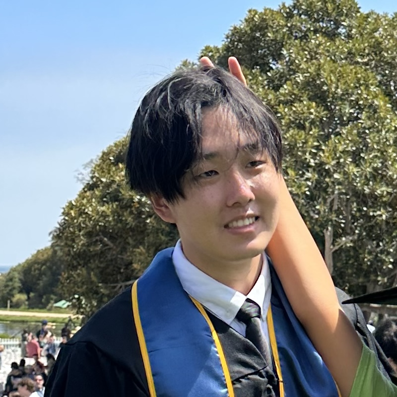

<!-- pfp -->
<!--  -->
 

 
 
I'm an incoming student at [Brown University](https://cs.brown.edu/) pursuing an ScM in Computer Science. Previously, I graduated from [UCSB](https://www.cs.ucsb.edu/) with a B.S. in Computer Science, advised by Prof. Zheng Zhang. My [research](./Research.md) interests lie in [efficient](./tags/efficient-ml) machine learning. Specifically I aim to build smaller models by exploring low-rank structure.
‍\
\
When I'm not coding, I enjoy playing [piano](./Misc/Piano.md), tending to my [succulents](./Misc/Succulents.md), and playing basketball.
\
\
Feel free to connect with me:
- [Email](mailto:richard_gao@brown.edu)
- [LinkedIn](https://www.linkedin.com/in/richard-gao-98490a1ba/)
- [GitHub](https://github.com/boopa5)