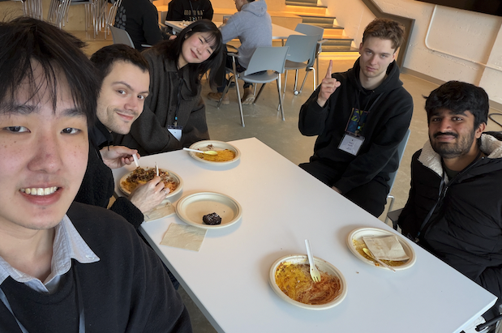

 

 

I'm currently a master's student in CS at [Brown University](https://cs.brown.edu/) working with Prof. [George Konidaris](https://cs.brown.edu/people/gdk/) and Prof. [Randall Balestriero](https://randallbalestriero.github.io/). I graduated from [UCSB](https://www.cs.ucsb.edu/) in 2024, where I studied CS and was advised by Prof. [Zheng Zhang](https://web.ece.ucsb.edu/~zhengzhang/). My current research interests lie in  *<ins>discovering abstractions through reinforcement learning  and world models for decision making</ins>*. In a past life, I worked on zeroth-order optimization and tensor-compressed learning.

  <a href="mailto:richard_gao@brown.edu">Email</a> /
  <a href="https://www.linkedin.com/in/richard-gao-98490a1ba/">LinkedIn</a> /
  <a href="https://github.com/rwgao1">GitHub</a> /
  <a href="https://x.com/_rwgao">Twitter</a>

<!-- 

  
  &nbsp;&nbsp;&nbsp;
  
  &nbsp;&nbsp;&nbsp;
  

 -->
---

## News
- **Feb. 2026**: Attended the [world modelling workshop](https://world-model-mila.github.io/) in Montreal. 
      
- **Sep. 2025**: Started my master's at Brown.
---
## Misc.
When I'm not working, I enjoy playing [piano](./Misc/Piano.md), tending to my [succulents](./Misc/Succulents.md), and basketball.

_Places others (and you!) have accessed my site from:_
